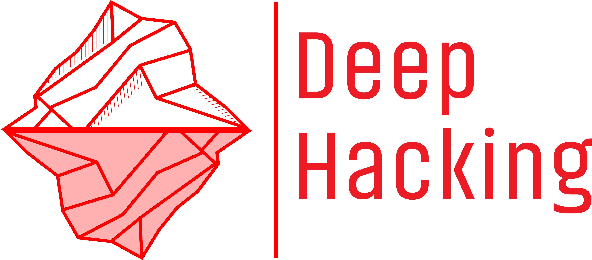
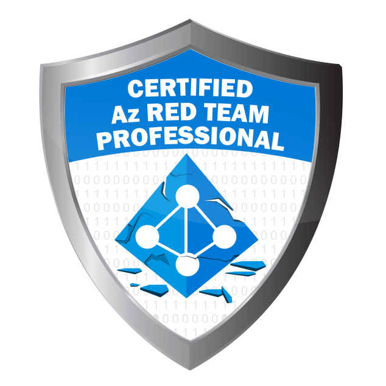
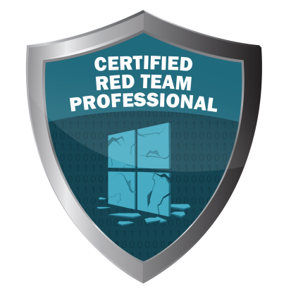

## Hi there 👋 I'm Sikumy 

I'm focused on **offensive security**, with a particular interest in **red teaming**.  

  
👾 About me

  

  
- I work in offensive security, doing things like red teaming, adversary simulation, and pentesting.
- I write a **cybersecurity blog in Spanish**, where I try to share what I’m learning along the way.
- I like to learn, a lot. I consider it one of my hobbies.
- Outside of tech, I enjoy **skiing** 🎿, **traveling** 🛩, and pretty much any **sport or outdoor activity** 🏐.

  
✠Blog

  

A blog where I share offensive security content, mostly in Spanish (for now 🤔). You can visit it here → [deephacking.tech](https://deephacking.tech)

  
📬 Contact

- 📧 Email: [sikumy@deephacking.tech](mailto:sikumy@deephacking.tech)  
- 🐦 Twitter: [@sikumy](https://x.com/sikumy)  
- 💼 LinkedIn: [juanantonio-gonzalez](https://www.linkedin.com/in/juanantonio-gonzalez/)  
- 💬 Discord: [Deep Hacking Discord](https://discord.gg/TVcDmHduAm)

  
🤓 Certifications & Trainings

  
  
  
  
  
  
  
  
  
  
  

